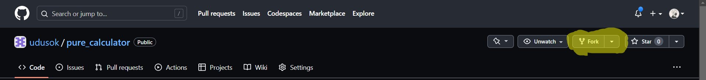
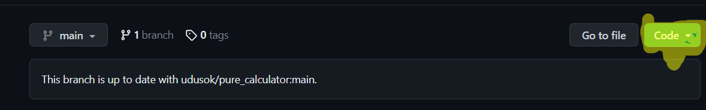
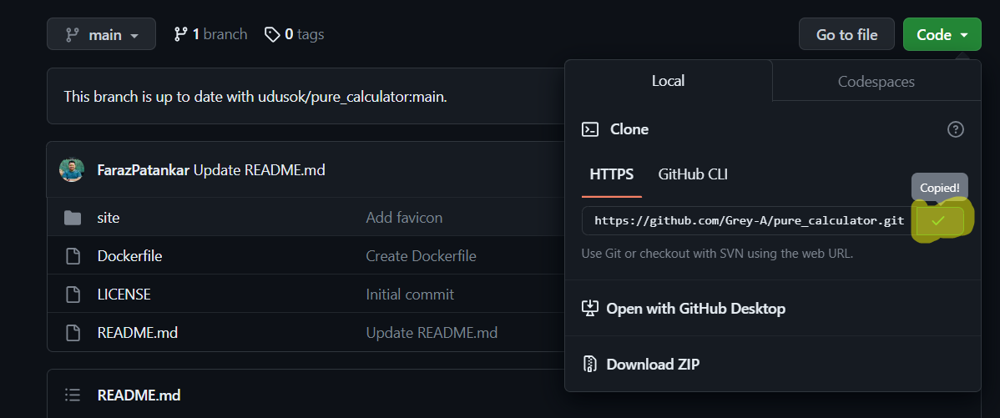
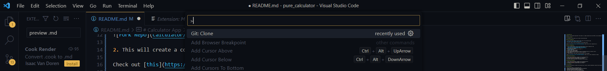
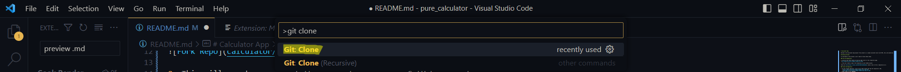
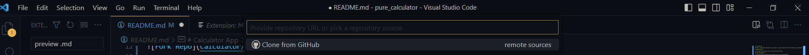
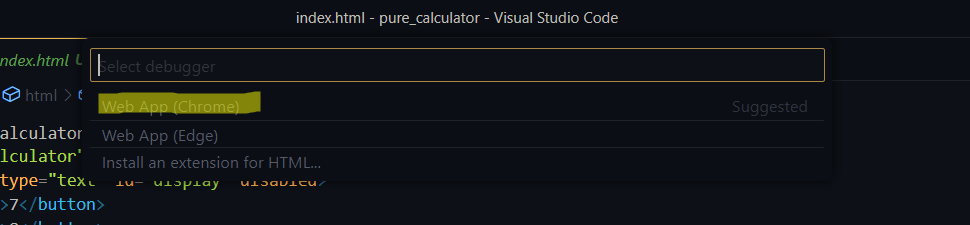
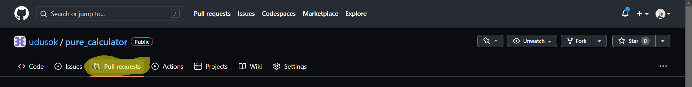
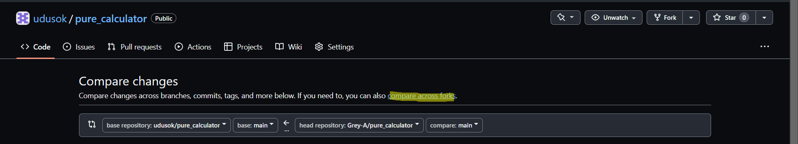

# Calculator App

Welcome to the Calculator App project! This project is a simple calculator built with HTML, CSS, and JavaScript.

## Getting Started

To contribute to this project, you'll need to follow these steps:

### Fork the Repository

1. Click on the "Fork" button at the top right corner of this repository page.

2. This will create a copy of the repository in your GitHub account.

Check out [this](https://vimeo.com/835173929/5a5616a5ae) video on how to fork a repository do it.

### Clone the Repository

1. On your forked repository, click on the "Code" button and copy the repository's URL.
   
   
2. Open vscode on your computer
3. Open the command palette with `Ctrl + Shift + P`.
   
4. Type "git clone" and press Enter.
   
5. Select the "Git: Clone" command.
6. In the "Repository URL" field, paste the URL of the GitHub repository you copied in step 1.
   
7. Select the location where you want to clone the repository.
8. Click "Clone".
9.  This will create a local copy of the pure_calculator on your computer

Check out [this](https://vimeo.com/835176096/4bb8d6d746) video on how to clone a repository on vscode 

### Running the Calculator

1. After cloning the repository, navigate into the project directory on vscode.
2. Locate the `index.html` file.
3. Click on F5 and it will open all the available ways you can run the html file. Webapp Chrome.
   
4. You should now see the calculator app in your browser.

## Contributing

We welcome contributions to enhance the Calculator App. To ensure a smooth collaboration, please follow these guidelines:

### Code Quality

- Write clean, readable, and maintainable code.
- Follow consistent naming conventions and formatting guidelines.
- Document your code using meaningful comments.
- Use proper indentation to improve code readability, using the prettier vscode extension is recommended.
- Write unit tests to cover your code for each function or the like.

### Contributing Guidelines

1. Create a new branch for your contributions:
   `git checkout -b feature/my-feature`
    Replace `my-feature` with a descriptive name for your feature or bug fix.
2. Commit your changes with clear and descriptive commit messages:
    `git commit -m "Add feature: Description of the feature"`
3. Push your changes to your forked repository:
   `git push origin feature/my-feature`
4. Open a pull request (PR) on the original repository:
- Go to the original repository on GitHub `https://github.com/udusok/pure_calculator`. 
- Click on "Pull requests" and then "New pull request."
  
  
- Click on Compare against forks.
  
- Provide a clear title and description for your pull request, explaining the changes made.
5. Wait for the code review and address any feedback received.

Check [this](https://vimeo.com/835186633/248bb95615) video on how to create a pull request to the repository.

[Live Link](https://udusok-pure-calculator.up.railway.app/)
